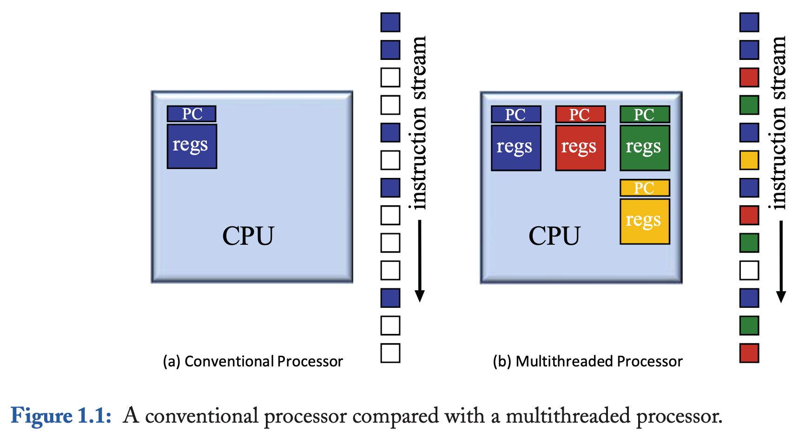
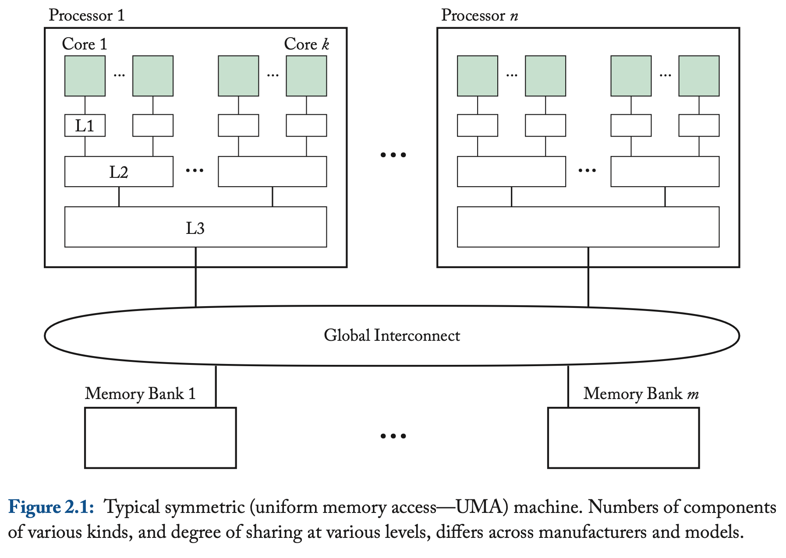
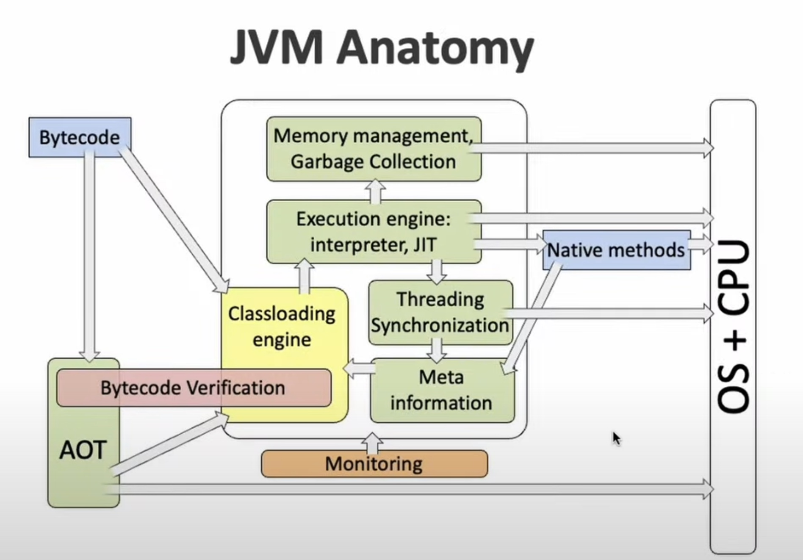
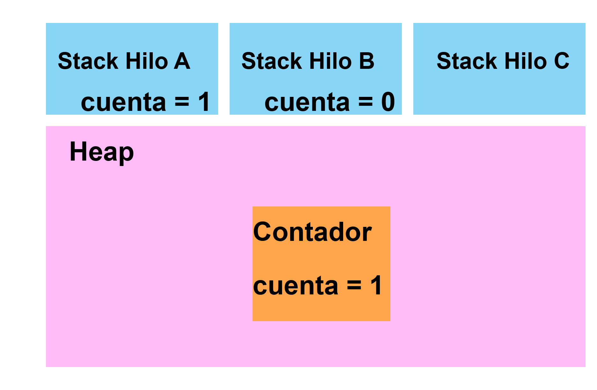

# Contexto

> “La necesidad de sincronización surge siempre que existan operaciones que se ejecutan de forma concurrente sin importar si realmente se ejecutan en paralelo”. \[cite:@scottSharedMemory\]

Esta observación data de los años 60’s por Edsger Dijkstra. A pesar de que las arquitecturas *multiprocesador* surgen a inicios de los 2000’s, las arquitecturas *multihilo* surgieron antes.

En una **arquitectura multihilo** un solo procesador tiene la capacidad de seguir múltiples programas de ejecución distintos sin la necesidad de intervención del software, ya que esto requeriría múltiples ciclos del procesador. En cambio, permite cambiar de un programa de ejecución o hilo a otro a partir del almacenamiento de los estados de los hilos en el hardware. Esto potencia un uso más eficiente de recursos del procesador, como se observa en la Figura [fig:multithreads1](fig:multithreads1).

Las primeras máquinas con arquitecturas multihilo surgieron en los años 50’s, la DYSEAC y la SEAC. \[cite:@tullsenMultithreading\]

<figure id="fig:multithreads1">

<figcaption>Imagen obtenida de [cite:@tullsenMultithreading]</figcaption>
</figure>

Una **arquitectura multiprocesador** está conformada por múltiples procesadores y permite ejecutar dos hilos o más en el mismo ciclo, es decir, de forma paralela, debido a que los recursos de ejecución de cada hilo están distribuidos en los procesadores; y los procesadores a su vez tienen múltiples *cores*.

En la Figura [fig:multithreads2](fig:multithreads2) se muestra un ejemplo de una arquitectura moderna, en donde cada procesador tiene múltiples cores, los cuales comparten determinadas instancias de memoria (Caché L1, L2, L3, etc.) y se comunican por un bus de memoria unificada. En la actualidad cada core tiene la capacidad de almacenar más de un hilo. \[cite:@Hyperth\] Cada arquitectura es distinta dependiendo del fabricante.

<figure id="fig:multithreads2">

<figcaption>Imagen obtenida de [cite:@scottSharedMemory]</figcaption>
</figure>

## Definiciones

Los **hilos/procesos** se utilizan de forma diferente según distintos autores. Por ejemplo, según Linus Torvalds un hilo/proceso es simplemente un *contexto de ejecución*. Sin embargo, en el curso consideraremos las definiciones a continuación:

- Un **proceso** es un programa en ejecución.
- Un **hilo** es un proceso que puede ejecutarse de forma paralela con otros hilos concurrentes y compartir recursos (por ejemplo: variables).

Un proceso también se puede considerar como un conjunto de hilos que comparten el espacio del proceso (memoria, disco, CPU, etc.).

# Multihilos en Java

## Arquitectura de la JVM

<figure id="fig:jvmanatomy">

<figcaption>Imagen obtenida de [cite:@youtubeJVMAnatomy]</figcaption>
</figure>

En la Figura [fig:jvmanatomy](fig:jvmanatomy) se muestra la anatomía de la JVM. En este curso nuestras áreas de interés son: *Thread Synchronization* y *Memory Management*.

Un hilo en Java se implementa por un hilo nativo del sistema operativo. Cada hilo tiene una región de memoria reservada denominada *stack* de cada hilo. Cada *stack* contiene variables locales y configuraciones de métodos que son ejecutados por el hilo (el tamaño de las stacks es variable en la JVM).

En relación con la asignación de memoria en Java, cada objeto nuevo creado con el operador *new* reside en la memoria llamada *Java heap*, la cual está especificada por la JVM (y no por los programadores). Esta heap debe ser rápida y *thread-safe*; por eso cada hilo tiene su propia región en esta heap.

<figure id="fig:javaheap">

<figcaption>Representación de la memoria en Java</figcaption>
</figure>

## Hilos en Java

Un hilo en Java es una instancia de la clase `java.lang.Thread`: [Documentación oficial de Thread](https://docs.oracle.com/javase/8/docs/api/java/lang/Thread.html).

Podemos crear un hilo de dos formas distintas:

1.  Extendiendo la clase `Thread` y sobrescribiendo el método `run()`.
2.  Implementando la interfaz `Runnable` para pasarla como argumento de un objeto de la clase `Thread`.

Un hilo de la clase Thread tiene los siguientes atributos:

- ID
- Nombre
- Prioridad
- Status: consta de 5 estados

Los 5 estados son:

1.  *New*: el hilo se ha creado pero no ha empezado.
2.  *Runnable*: el hilo está siendo ejecutado por la JVM.
3.  *Blocked*: el hilo está bloqueado y está esperando por un monitor (`sleep()`, `await()`).
4.  *Timedwaiting*: un hilo está esperando a otro por un lapso de tiempo específico.
5.  *Terminated*: un hilo ha terminado su ejecución.

# Ejemplos

Repositorio con ejemplos: [ProgramasP1 (GitHub)](https://github.com/surindt/FC_CConcurrente/tree/main/Programas_P1)

- Programa 1 (ExampleThreads): Creación de un hilo.
- Programa 2 (ExampleMultipleExtends): Ejemplo de un contador extendiendo la clase Thread.
- Programa 3 (ExampleMultipleRunnable): Ejemplo de un contador implementando la interfaz Runnable.
- Programa 4 (MainThread): Ejemplo de un contador que no termina.
- Programa 5 (AlwaysDesignToStop): Ejemplo de un contador que termina solo si el hilo principal lo detiene.
- Programa 6 (UseJoin): Uso de `join()`.
- Programa 7 (ExampleMultipleExtends2): Ejemplo de un contador extendiendo la clase Thread, compartiendo un contador.
- Programa 8 (ExampleMultipleRunnable2): Ejemplo de un contador implementando Runnable, compartiendo un contador.
- Programa 9 (FibonacciThreads): Programa no muy paralelizable.
- Programa 10 (DeterminanteConcurrente): Programa para obtener el determinante de una matriz de 3x3.

# Ejercicios

## Instrucciones

- Entrega en un **PDF** las respuestas de los ejercicios que no requieran implementarse. En los ejercicios que requieran implementación añade una breve descripción de los programas que entregas (sus nombres y qué hacen).

- Solo un integrante del equipo debe subir la práctica. Los demás integrantes deben marcar la tarea como entregada y escribir, en un comentario privado dentro de la práctica, el nombre completo de la persona que realizó la entrega.

- Todos los programas y el PDF deben ir dentro de un **archivo ZIP**. El archivo ZIP debe seguir el formato: `P#k_ApellidoPaternoNombre`, usando el apellido y nombre de la persona que entrega la práctica.

- Cada ejercicio debe tener un programa que indique “Implementar” si aplica.

- Recuerda que debes utilizar **Java 21 LTS**.

- **Si no compila utilizando Java 21 LTS o si no se entrega la breve descripción de los programas se penalizará.**

- **Tiempo de elaboración:** ≈ 1.5 hr

- **Total de puntos:** 100

## Ejercicios

1.  Lee lo siguiente: [Threading: Linus Torvalds (Evan Jones)](https://www.evanjones.ca/software/threading-linus-msg.html) y comparte en máximo 4 líneas: ¿a qué se refiere Linus Torvalds con *un contexto de ejecución* y cómo se relaciona con la definición en la sección **Contexto** de esta práctica?

2.  ¿Cuántos hilos tiene disponibles tu computadora? Ejecuta `Runtime.getRuntime().availableProcessors()`. Si son más de uno en el equipo, escriban el de cada uno.

3.  Revisa el programa **DeterminanteConcurrente** y responde: ¿Cuánto tiempo tarda en ejecutarse?

4.  El programa **DeterminanteConcurrente** está implementado extendiendo la clase Thread. Implementa el programa utilizando la interfaz Runnable. **(Implementar)**

5.  Implementa el programa **DeterminanteConcurrente** de forma secuencial. **(Implementar)**

6.  Implementa el programa **DeterminanteConcurrente** para dos hilos (en vez de seis). **(Implementar)**

7.  Compara las 3 implementaciones: dos hilos, seis hilos y secuencial. Responde: ¿A qué se debe el orden en el que se ordenan los tiempos de ejecución de cada programa?

8.  Si utilizas la Ley de Amdahl entre el programa **DeterminanteConcurrente** para dos hilos y el programa secuencial: ¿El resultado es mayor o menor a 1? ¿Por qué?

9.  Describe con tus propias palabras (máximo dos líneas) para qué sirve el método `join()`. Si no utilizas `join()` en **DeterminanteConcurrente**, ¿sigue funcionando?

# Bibliografía
