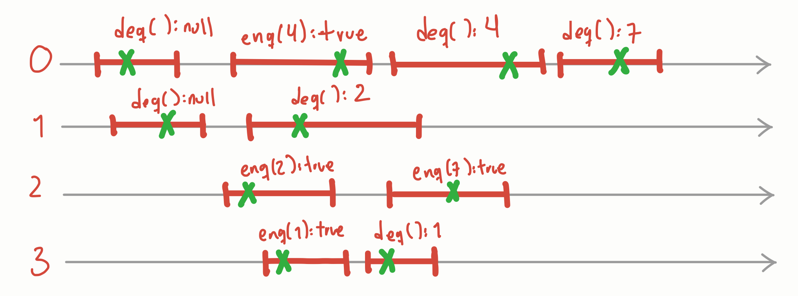

# 1. El Problema: El Patio, el Gato y el Perro

Para entender cómo se coordinan dos procesos, imaginemos a dos vecinos, **Alice** y **Bob**, que comparten un patio. El problema es sencillo pero crítico:

- ****Alice**** tiene un gato.
- ****Bob**** tiene un perro.
- ****Restricción:**** El gato y el perro no se llevan bien. Si coinciden en el patio, ¡caos total!

## Las Reglas del Juego (Restricciones de Comunicación)

Para que esto sea un problema de computación real, añadimos restricciones:

1.  No pueden verse (el patio es enorme).
2.  No pueden gritarse (están lejos).
3.  ****Solo hay banderas:**** Cada uno tiene una bandera en su ventana que el otro puede ver. Esto representa ****bits en memoria compartida****.

# 2. El Protocolo de Banderas

¿Cómo evitar que choquen usando solo banderas? Aquí está el primer intento de algoritmo:

## El Protocolo de Alice (El Gato)

1.  Levanto mi bandera.
2.  Miro la ventana de Bob. Si su bandera está ****abajo****, dejo salir al gato.
3.  Cuando el gato regrese, bajo mi bandera.

## El Protocolo de Bob (El Perro)

1.  Levanto mi bandera.
2.  Miro la ventana de Alice. Si su bandera está ****arriba****:
    - Bajo mi bandera (cedo el paso).
    - Espero a que la bandera de Alice baje.
    - Levanto mi bandera y repito el chequeo.
3.  Si su bandera está abajo, dejo salir al perro.
4.  Al volver, bajo mi bandera.

# 3. Análisis de Seguridad (Safety)

¿Funciona? Lo primero es garantizar que ****nunca estén juntos en el patio****.

## Teorema: Exclusión Mutua

El algoritmo satisface la exclusión mutua.

- **Prueba por contradicción:** Si ambos estuvieran dentro, Alice debió ver la bandera de Bob abajo, y Bob debió ver la de Alice abajo. Pero para que Alice entre, su bandera ya debe estar arriba. Bob, al verla arriba, por protocolo ****está obligado a bajar la suya y esperar****. Es imposible que ambos vean la bandera del otro abajo simultáneamente después de haber levantado la propia.

# 4. Análisis de Viveza (Liveness)

Aquí es donde el algoritmo se pone a prueba frente a situaciones del mundo real.

## ¿Hay Deadlock? (Punto muerto)

**Pregunta para el lector:** Si ambos levantan la bandera al mismo tiempo, ¿se quedan trabados para siempre?

- ****Respuesta:**** No. Bob es "educado". Si ve conflicto, baja su bandera y permite que Alice pase. El sistema siempre progresa.

## ¿Hay Starvation? (Inanición)

**Pregunta para el lector:** Si Alice es muy egoísta y siempre quiere sacar al gato, ¿podría Bob quedarse esperando para siempre?

- ****Respuesta:**** En teoría, una vez que Alice baja su bandera para meter al gato, hay una ventana de tiempo donde Bob puede levantar la suya y ganar el acceso. Sin embargo, si Alice es infinitamente rápida, Bob podría tener mala suerte.

## El talón de Aquiles: Tolerancia a Fallos

**Escenario de terror:** Alice levanta su bandera y, justo antes de salir al patio, ¡se queda dormida (su proceso falla/hace crash)!

- ****Resultado:**** Su bandera se queda arriba para siempre.
- ****Consecuencia para Bob:**** Bob verá la bandera de Alice arriba perpetuamente, bajará la suya y esperará… **por toda la eternidad**.

**Moraleja:** Este algoritmo ****no es tolerante a fallos****. La caída de un hilo bloquea a los demás.

# 5. Conclusión: El Modelo SWMR

Este pequeño ejercicio nos muestra el poder de las variables ****SWMR**** (Single-Writer, Multi-Reader).

- Solo Alice escribe su bandera.
- Solo Bob escribe su bandera.
- Ambos pueden leer la del otro.

Este es el nivel más básico de coordinación en hardware. En las siguientes notas, veremos cómo mejorar esto para que sea ****Wait-free**** (que nadie tenga que esperar, incluso si otros fallan).

—

- [¿Qué es la computación concurrente?](1-intro-que-porque-paraque.md)
- [Alice y Bob: El problema de la interferencia](2-historias-con-moraleja.md)
- [Linearizabilidad: ¿Cómo evitar el choque de mascotas?](3-linearizabilidad-vs-sc.md)
